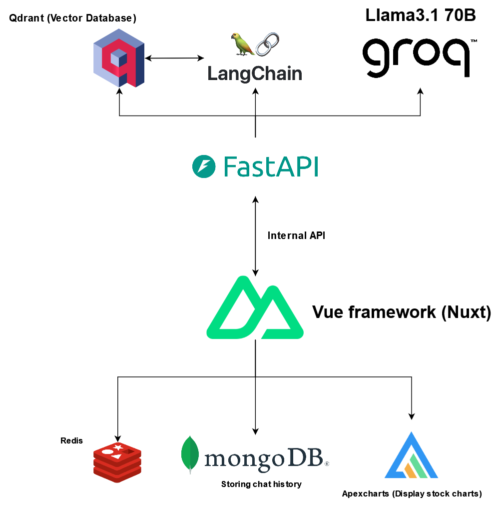

# Mirsad

This repository is a project that created for KSU datathon competition.

**__Note__**:  The project is meant to be **ONLY** for educational purposes.

## Description about the project
The project is called "Mirsad", it's a chatbot that interact with a `SaudiExchange` data and returns information about the company based on user's query.
* This project is implemented only in 2 days (Expect **bugs** & **Poor implementations**).

## Mirsad Architecture

## Repository directory
* Web layer: [Click here](/Web)
* Model layer: [Click here](/Model/)

## Credits
* Rakan Almutairi - @zRakan
* Faisal Almansour - @BlazeCode1
* Anas Alshehri - @AnasShehri
* Mohammed Alawashez - @Alawashez2
* Saleh Altuwaijri - @salehtwj